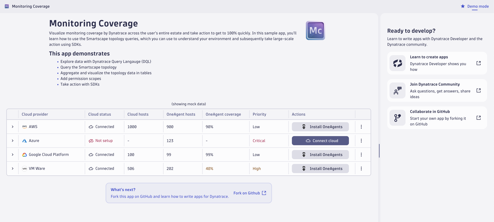

# Monitoring Coverage Sample App

This is a project to demonstrate how to use DQL to query the entity model, visualize the data, and take action.
The app helps users understand which hosts are _not_ monitored by Dynatrace today.


## Support
Please note that the app is intended mostly for educational purposes and should not be used as-is for production scenarios. It is covered under the “light support” provisions of the Dynatrace terms and conditions.

## TL;DR
You can start using this Sample App now:
1. Clone this repo to your localhost
2. Edit `env.ts` to point to your environment
3. Test locally: `npm run start`
4. Deploy using `npm run deploy`

Or, keep reading to understand how to modify this app for your own purposes or build your own.

Or, watch our Observability Clinic about this app on YouTube:
[](https://www.youtube.com/watch?v=0cbdymD_2tc)

# Let's find the data with DQL

To build this app together, we'll start by creating some DQL queries in a Notebook.

## HybridCloud coverage

Before we get into Monitoring Candidates, we need to make sure relavent Hybridcloud integrations are configured.

### Which clouds are we using?

Let's start by finding out the number of OneAgent hosts for each cloud using:

```
fetch dt.entity.host
| filter cloudType <> "" OR hypervisorType == "VMWARE"
| fieldsAdd cloudType
| summarize by:{cloudType}, count()
```

We can see from the results that Dynatrace uses `EC2`, `AZURE`, and `GOOGLE_CLOUD_PLATFORM`, `VMWARE` for AWS, Azure, GCP, and VMWare.

<!--### Are integrations enabled for our clouds?

<magic/>-->

## Cloud Hosts

Now let's find out how many hosts we know about through the cloud integrations and also get a list of them filtered by which are not related to a OneAgent host:

### EC2s
```
fetch dt.entity.EC2_INSTANCE
| filter arn != ""
| summarize count(), alias:num
```

```
fetch dt.entity.EC2_INSTANCE
| fieldsAdd host=runs[dt.entity.host], entity.detected_name, ipAddress = localIp
| lookup [fetch dt.entity.host | fieldsAdd isMonitoringCandidate], sourceField:host, lookupField:id, prefix:"host."
| filterOut host.isMonitoringCandidate == false
| fields id, entity.name, entity.detected_name, ipAddress = localIp
```

### Azure VMs
```
fetch dt.entity.azure_vm
| summarize count(), alias:num
```

```
fetch dt.entity.azure_vm
| fieldsAdd host=runs[dt.entity.host], entity.detected_name, ipAddress
| lookup [fetch dt.entity.host | fieldsAdd isMonitoringCandidate], sourceField:host, lookupField:id, prefix:"host."
| filterOut host.isMonitoringCandidate == false
| fields id, entity.name, entity.detected_name, ipAddress
```

### GCP CE VMs
```
fetch \`dt.entity.cloud:gcp:gce_instance\`
| summarize count(), alias:num
```

```
fetch `fetch \`dt.entity.cloud:gcp:gce_instance\`
| lookup [fetch \`dt.entity.host\`
  | filter gceInstanceId <> ""
  | fieldsAdd instance_id=gceInstanceId], lookupField: gceInstanceId, sourceField:entity.name
| filter isNull(lookup.id)
//| fieldsAdd ipAddress
```

### VMWare VMs
```
fetch dt.entity.virtualmachine
| summarize count(), alias:num
```

```
fetch dt.entity.virtualmachine
| fieldsAdd ip = ipAddress[0]
| lookup [fetch dt.entity.host
  | filter in(id,entitySelector("type(host),fromRelationships.runsOn(type(virtualmachine))"))
  | fieldsAdd ip = ipAddress[0]], lookupField: ip, sourceField:ip
| filter isNull(lookup.ip)
| fields id, entity.name, ipAddress=ip
| limit 100000
```

# Let's build an app

So now we have all of our data, let's make it easy for our whole team to use it with an app.

## Create from template

Follow directions on https://developer.dynatrace.com/preview/getting-started/quickstart/ to create an app

## Let's sketch out our UI

Create a new Page `Coverage.tsx`.

### Add our necessary imports

```
import React, {useState} from "react";
import { Flex, Heading } from "@dynatrace/wave-components-preview";

export const Coverage = () => {
    return (

    )
}
```

### Sketch the UI
We will use `Flex` components for creating columns and rows and for positioning. We'll just leave placeholders for Icon and Table components that'll create next.
```
<Flex flexDirection="column">
    <Heading>Monitoring Coverage</Heading>
    <Flex flexDirection="column">
        <Flex flexDirection="row">
            <div>Icon</div>
            <Heading level={2}>Hybrid Cloud</Heading>
        </Flex>
        <div>Cloud table</div>
    </Flex>
    <Flex flexDirection="column">
        <Flex flexDirection="row">
            <div>Icon</div>
            <Heading level={2}>Unmonitored Hosts</Heading>
        </Flex>
        <div>Unmonitored hosts table</div>
    </Flex>
</Flex>
```
Run your app now with `npm run start` to see how it looks.

### Sketch tables
Next, create components `CloudTable` and `UnmonitoredHostTable`:
```
<div>
    <DataTable columns={columns} data={data} />
    <Modal title={`Add integration`} show={modalOpen} onDismiss={() => setModalOpen(false)}>
    <Flex flexDirection="column">
        <span>Get info from user here:</span>
        <Flex flexItem flexGrow={0}>
        <Button
            variant="primary"
            onClick={() => {
            setModalOpen(false);
            }}
        >
            Connect
        </Button>
        </Flex>
    </Flex>
    </Modal>
</div>
```

After you've imported the necessary components `DataTable`, `Modal`, `Flex`, and `Button` you'll notice you still have other unresolved symbols. We need a state variable to tell whether our popup, or modal, is open or not. Let's import `useState` from React and add it above the `return` in our component, like this:
```
export const CloudTable = () => {
  const [modalOpen, setModalOpen] = useState(false);
  ...
```

You'll also notice that `DataTable` wants some inputs. For now, just stub out your tables with some fake values, like so:
```
  const columns = useMemo<TableColumn[]>(
    () => [
      { accessor: "cloud" },
      { accessor: "status" },
      { accessor: "hosts" },
      {
        header: "Actions",
        cell: () => {
          return (
            <Flex>
              <Button
                onClick={() => {
                  setModalOpen(true);
                }}
              >
                Setup
              </Button>
            </Flex>
          );
        },
      },
    ],
    []
  );
  const data = [
    { cloud: "AWS", status: "??", hosts: "??" },
    { cloud: "Azure", status: "??", hosts: "??" },
    { cloud: "GCP", status: "??", hosts: "??" },
    { cloud: "VMWare", status: "??", hosts: "??" },
  ];
```

Let's also replace the placeholders `<div>`s in our page with our new components and run our app again.

## Create hooks for our data

A hook allows us to change our app's state based on our process for getting the data. The template already includes a `useDQLQuery` hook which we could adapt, or we can create our own. For simplicity, let's create our own called `useRealCloudData` and use `queryClient` to execute DQL.
```
const fetchQueries = () => {
    try {
      setRunningDQL(true);
      const oneAgentHostsQuery = queryClient.query({
        //get the number of hosts with OneAgents, split by cloud
        query: `fetch dt.entity.host
              | filter cloudType <> "" OR hypervisorType == "VMWARE"
              | fieldsAdd cloud = if(cloudType <> "", cloudType, else:"VMWare")
              | summarize by:{cloud}, count()`,
      });
      ...
```

Now we'll call `useRealCloudData` in our Coverage page and pass the data to our tables:
```
const { realCloudData, fetchQueries, runningDQL } = useRealCloudData();
```

```
<Flex flexDirection="column">
  <CloudTable
    data={demoMode ? mockCloudData : realCloudData}
    fetchQueries={fetchQueries}
    demoMode={demoMode}
    runningDQL={runningDQL}
  />
</Flex>
```

Now you should be able to run the app again and see real Smartscape data from DQL!
